# Dataflow Monitor Crew - Design Document

## 🎯 Purpose

The Dataflow Monitor Crew is an intelligent query agent that answers natural language questions about member connectivity and data flow health across healthcare providers. Instead of generating static reports, it responds to analytical queries in real-time.

---

## 📋 Use Cases & Example Queries

### Authentication Issues
```
"Tell me all members who are deauthed"
"Show members with expired Fitbit authentication"
"Which members never authorized any devices?"
"List all members with authentication issues"
```

### Data Flow Issues
```
"Show members with no data flow in last 10 days"
"Which members haven't sent data in 2 weeks?"
"Find members where data stopped flowing"
"Members with no vitals data in 7 days"
```

### App Status Issues
```
"Which members deleted the app?"
"Show members with inactive apps for more than 5 days"
"List members who never installed the app"
"Members with app issues"
```

### Source-Specific Issues
```
"Show all members with Fitbit issues"
"Which members have Garmin not flowing?"
"List Apple Health Kit connection problems"
"Members where webhooks are coming but data not processing"
```

### Provider Summaries
```
"Give me a health summary for provider XYZ"
"What percentage of members are flowing?"
"Break down issues by device type"
"Show me critical issues requiring immediate attention"
```

### Follow-up Questions (Detailed Reports)
```
After any multi-member query:
Agent: "💡 Would you like a detailed analysis report for any of these members?"

User: "Yes, show me details for John Doe"
User: "Generate full report for member mem_123"
User: "I want detailed analysis"
```

---

## 🏗️ Architecture Overview

### High-Level Flow (Two-Stage Interaction)

```
┌──────────────────────────────────────────────────────────────────────────┐
│  STAGE 1: Answer Query                                                   │
└──────────────────────────────────────────────────────────────────────────┘

┌─────────────────────────────────────────────────────────────┐
│  User Query (Natural Language)                              │
│  "Tell me all members who are deauthed"                     │
└─────────────────────────┬───────────────────────────────────┘
                          │
                          ▼
┌─────────────────────────────────────────────────────────────┐
│  Dataflow Query Agent (Single Agent)                        │
│  - Parse query intent                                       │
│  - Identify query parameters                                │
│  - Select appropriate tool                                  │
│  - Format results for user                                  │
└─────────────────────────┬───────────────────────────────────┘
                          │
                          ▼
┌─────────────────────────────────────────────────────────────┐
│  Query Tools (Filter & Aggregate)                           │
│  - find_members_by_auth_status()                           │
│  - find_members_by_data_flow()                             │
│  - find_members_by_app_status()                            │
│  - find_members_by_source_issues()                         │
│  - get_provider_health_summary()                           │
└─────────────────────────┬───────────────────────────────────┘
                          │
                          ▼
┌─────────────────────────────────────────────────────────────┐
│  Analytics Engine (Existing diagnostic_apis.py)             │
│  - Run member diagnostics concurrently                      │
│  - Filter by criteria                                       │
│  - Aggregate results                                        │
└─────────────────────────┬───────────────────────────────────┘
                          │
                          ▼
┌─────────────────────────────────────────────────────────────┐
│  Response + Follow-up Offer                                 │
│                                                              │
│  "Found 3 members with expired authentication:              │
│   1. John Doe (mem_123) - Fitbit expired                   │
│   2. Jane Smith (mem_456) - Garmin expired                 │
│   3. Bob Wilson (mem_789) - Apple Health expired           │
│                                                              │
│  💡 Would you like a detailed analysis for any member?"     │
└─────────────────────────┬───────────────────────────────────┘
                          │
                          │ User: "Yes, show John Doe"
                          ▼
┌──────────────────────────────────────────────────────────────────────────┐
│  STAGE 2: Generate Detailed HTML Report (If Requested)                  │
└──────────────────────────────────────────────────────────────────────────┘

┌─────────────────────────────────────────────────────────────┐
│  Agent calls: generate_detailed_html_report(mem_123)        │
└─────────────────────────┬───────────────────────────────────┘
                          │
                          ▼
┌─────────────────────────────────────────────────────────────┐
│  Tool integrates with existing router.py:                   │
│  - DeviceFlowDebugger.debug_single_member()                 │
│  - generate_member_html() [from router.py]                  │
└─────────────────────────┬───────────────────────────────────┘
                          │
                          ▼
┌─────────────────────────────────────────────────────────────┐
│  Full HTML Diagnostic Report                                │
│  ┌───────────────────────────────────────────────┐         │
│  │  🔗 Connection Health Report                  │         │
│  │  ─────────────────────────────────────────    │         │
│  │  Status: Data Stopped for 2d 5h              │         │
│  │  Issue: Fitbit authentication expired         │         │
│  │  Action: Re-authenticate Fitbit               │         │
│  │  AMA: Active | iOS (17.1.1) | v2.4.0         │         │
│  │                                                │         │
│  │  📋 Data Sources                              │         │
│  │  [Detailed table with all sources...]         │         │
│  │                                                │         │
│  │  [View Details Button]                        │         │
│  │  └─ Full auth history                         │         │
│  │  └─ Integration details                       │         │
│  │  └─ Recent activity timeline                  │         │
│  │  └─ Troubleshooting tips                      │         │
│  └───────────────────────────────────────────────┘         │
│                                                              │
│  📥 Download Report | 🔄 View Another Member               │
└─────────────────────────────────────────────────────────────┘
```

---

## 🔍 Query Flow Examples

### Example 1: "Tell me all members who are deauthed"


### Example 2: "Show members with no data flow in last 10 days"


### Example 3: Follow-up for Detailed Analysis (Integration with Existing HTML Reports)

```mermaid
sequenceDiagram
    participant User
    participant Agent as Dataflow Query Agent
    participant QueryTool as find_members_by_auth_status
    participant ReportTool as generate_detailed_html_report
    participant Router as router.py (existing)
    participant Engine as diagnostic_apis.py

    User->>Agent: "Tell me all deauthed members"
    Agent->>QueryTool: find_members_by_auth_status(status="expired")
    QueryTool-->>Agent: [John Doe, Jane Smith, Bob Wilson]
    Agent-->>User: "Found 3 members with expired auth:\n1. John Doe (mem_123) - Fitbit expired\n2. Jane Smith (mem_456) - Garmin expired\n3. Bob Wilson (mem_789) - Apple Health expired\n\n💡 Would you like a detailed analysis for any member?"
    
    User->>Agent: "Yes, show me details for John Doe"
    Agent->>Agent: Parse: member_id="mem_123"
    Agent->>ReportTool: generate_detailed_html_report(member_id="mem_123")
    ReportTool->>Engine: debug_single_member(member_id="mem_123")
    Engine-->>ReportTool: MemberDebugReport object
    ReportTool->>Router: generate_member_html(report)
    Router-->>ReportTool: Full HTML diagnostic report
    ReportTool-->>Agent: {html_content, download_url, summary}
    Agent-->>User: [Renders HTML Report with Download Button]
```



---

## 💬 Complete Conversational Flow Example

### Scenario: Finding Deauthed Members with Detailed Follow-up

```
┌─────────────────────────────────────────────────────────────┐
│ User: "Tell me all members who are deauthed"                │
└─────────────────────────────────────────────────────────────┘

┌─────────────────────────────────────────────────────────────┐
│ Agent: [Calls find_members_by_auth_status(status="expired")]│
│                                                              │
│ Response:                                                    │
│ "Found 3 members with expired authentication:               │
│                                                              │
│ 1. **John Doe** (mem_123)                                   │
│    - Fitbit authentication expired 2 days ago               │
│    - Action: Re-authenticate Fitbit connection              │
│                                                              │
│ 2. **Jane Smith** (mem_456)                                 │
│    - Garmin authentication expired 5 hours ago              │
│    - Action: Re-authenticate Garmin connection              │
│                                                              │
│ 3. **Bob Wilson** (mem_789)                                 │
│    - Apple Health authentication expired 1 day ago          │
│    - Action: Re-authenticate Apple Health                   │
│                                                              │
│ 💡 Would you like a detailed analysis report for any        │
│    of these members?"                                       │
└─────────────────────────────────────────────────────────────┘

┌─────────────────────────────────────────────────────────────┐
│ User: "Yes, show me details for John Doe"                   │
└─────────────────────────────────────────────────────────────┘

┌─────────────────────────────────────────────────────────────┐
│ Agent: [Calls generate_detailed_html_report("mem_123")]     │
│                                                              │
│ Response:                                                    │
│ "Here's the comprehensive diagnostic report for             │
│  John Doe (mem_123):                                        │
│                                                              │
│ [RENDERS FULL HTML REPORT]                                  │
│                                                              │
│ ┌──────────────────────────────────────────┐               │
│ │ 🔗 Connection Health Report               │               │
│ │ ─────────────────────────────────────     │               │
│ │                                            │               │
│ │ Status: ⚠️ Data Stopped for 2d 5h 19m    │               │
│ │ Issue: Fitbit authentication expired      │               │
│ │ Action: Re-authenticate Fitbit            │               │
│ │ AMA: Active | iOS (17.1.1) | v2.4.0      │               │
│ │                                            │               │
│ │ 📋 Data Sources                           │               │
│ │ ┌──────────────────────────────────────┐ │               │
│ │ │Source    │Auth    │Last Received    ││ │               │
│ │ ├──────────┼────────┼─────────────────┤│ │               │
│ │ │Fitbit    │Expired │2024-01-15 10:30 ││ │               │
│ │ │Apple HK  │Active  │2024-01-17 08:45 ││ │               │
│ │ │Native    │Active  │2024-01-17 09:15 ││ │               │
│ │ └──────────────────────────────────────┘ │               │
│ │                                            │               │
│ │ [View Details] ← Expandable sections      │               │
│ │  └─ 🔐 Recent Auth Activity               │               │
│ │  └─ 📡 Recent Webhook Events              │               │
│ │  └─ 🔗 Integration Details                │               │
│ │  └─ 🛠️ Troubleshooting Tips              │               │
│ └──────────────────────────────────────────┘               │
│                                                              │
│ 📥 Download Report (diagnostic_mem_123.html)                │
│ 🔄 View Another Member                                      │
│ ↩️ Back to List"                                            │
└─────────────────────────────────────────────────────────────┘

┌─────────────────────────────────────────────────────────────┐
│ User: "Show me Jane Smith's report"                         │
└─────────────────────────────────────────────────────────────┘

┌─────────────────────────────────────────────────────────────┐
│ Agent: [Calls generate_detailed_html_report("mem_456")]     │
│        [Renders Jane Smith's HTML report...]                │
└─────────────────────────────────────────────────────────────┘
```

**Key Features of This Flow:**
1. ✅ **Quick List First** - User gets immediate summary of issues
2. ✅ **Optional Deep Dive** - User can request detailed analysis if needed
3. ✅ **Natural Conversation** - Agent remembers context from previous query
4. ✅ **Download Option** - User can save HTML reports for sharing
5. ✅ **Multi-Member Drill-down** - Can view detailed reports for multiple members in sequence
6. ✅ **Reuses Existing Code** - HTML report is identical to existing `/diagnostic` endpoint

---

## 🛠️ Query Tools Specification

### Tool 1: `find_members_by_auth_status`

**Purpose:** Find members with specific authentication status

**Parameters:**
- `provider_id` (str, required): Provider identifier
- `status` (str, required): One of "expired", "active", "never_authorized"
- `source_name` (str, optional): Filter by specific source (e.g., "fitbit", "garmin")

**Returns:**
```python
List[{
    "member_id": str,
    "member_name": str,
    "auth_status": str,
    "expired_sources": List[str],
    "expired_times": Dict[str, str],  # source -> timestamp
    "recommended_action": str
}]
```

**Example Queries Handled:**
- "Tell me all members who are deauthed"
- "Show members with expired Fitbit auth"
- "List members who never authorized"

---

### Tool 2: `find_members_by_data_flow`

**Purpose:** Find members with data flow issues

**Parameters:**
- `provider_id` (str, required): Provider identifier
- `days_inactive` (int, required): Minimum days without data flow
- `include_root_cause` (bool, default=True): Include root cause analysis

**Returns:**
```python
List[{
    "member_id": str,
    "member_name": str,
    "days_since_last_data": int,
    "last_data_timestamp": str,
    "is_flowing": bool,
    "root_cause": str,
    "recommended_action": str
}]
```

**Example Queries Handled:**
- "Show members with no data flow in 10 days"
- "Members inactive for 2 weeks"
- "Find stopped data flows"

---

### Tool 3: `find_members_by_app_status`

**Purpose:** Find members with app usage issues

**Parameters:**
- `provider_id` (str, required): Provider identifier
- `status` (str, required): One of "deleted", "inactive", "not_installed", "active"
- `days_threshold` (int, optional): For "inactive" status, minimum days inactive

**Returns:**
```python
List[{
    "member_id": str,
    "member_name": str,
    "app_status": str,
    "last_activity": str,
    "hours_since_activity": float,
    "device_info": {
        "os": str,
        "version": str,
        "instrument": str
    },
    "recommended_action": str
}]
```

**Example Queries Handled:**
- "Which members deleted the app?"
- "Show inactive apps for 5+ days"
- "Members who never installed"

---

### Tool 4: `find_members_by_source_issues`

**Purpose:** Find members with specific device/source issues

**Parameters:**
- `provider_id` (str, required): Provider identifier
- `source_name` (str, optional): Specific source (e.g., "fitbit", "garmin", "apple_health_kit")
- `issue_type` (str, required): One of "not_flowing", "deauthed", "no_webhooks", "processing_error"

**Returns:**
```python
List[{
    "member_id": str,
    "member_name": str,
    "source_name": str,
    "issue_type": str,
    "issue_details": str,
    "last_received": str,
    "recommended_action": str
}]
```

**Example Queries Handled:**
- "Show Fitbit connection issues"
- "Members where Garmin not flowing"
- "Webhooks coming but not processing"

---

### Tool 5: `get_provider_health_summary`

**Purpose:** Get aggregated health metrics for provider

**Parameters:**
- `provider_id` (str, required): Provider identifier
- `group_by` (str, default="issue_type"): One of "issue_type", "source", "severity"
- `include_details` (bool, default=False): Include member-level details

**Returns:**
```python
{
    "provider_id": str,
    "total_members": int,
    "members_flowing": int,
    "members_with_issues": int,
    "health_percentage": float,
    "issues_breakdown": {
        "auth_expired": int,
        "data_stopped": int,
        "app_deleted": int,
        "app_inactive": int,
        "never_authorized": int
    },
    "critical_issues": int,  # requiring immediate attention
    "recommendations": List[str]
}
```

**Example Queries Handled:**
- "Give me health summary"
- "What percentage of members are healthy?"
- "Break down issues by type"

---

### Tool 6: `get_member_detail`

**Purpose:** Get comprehensive detail for a single member (fallback for specific queries)

**Parameters:**
- `member_id` (str): Member identifier
- `member_name` (str): Member name (if ID not available)
- `provider_id` (str, optional): Provider context

**Returns:**
```python
{
    "member_id": str,
    "member_name": str,
    "overall_status": str,
    "data_flow": {...},
    "auth_status": {...},
    "app_usage": {...},
    "sources": [...],
    "root_cause": {...},
    "recent_activity": [...]
}
```

**Example Queries Handled:**
- "What's wrong with John Doe?"
- "Check status of member mem_123"
- "Diagnose Alice Johnson"

---

### Tool 7: `generate_detailed_html_report`

**Purpose:** Generate comprehensive HTML diagnostic report for a member (integrates with existing router.py)

**Parameters:**
- `member_id` (str): Member identifier
- `format` (str, default="html"): Output format ("html" or "download")

**Returns:**
```python
{
    "member_id": str,
    "member_name": str,
    "html_content": str,  # Full HTML report
    "download_url": str,  # Optional: URL to download HTML file
    "report_summary": str  # Brief summary for chat display
}
```

**Implementation:**
This tool wraps the existing `diagnostic/router.py` functionality:
- Calls `DeviceFlowDebugger.debug_single_member(member_id)`
- Passes result to `generate_member_html(report)` from router.py
- Returns HTML for display/download

**Example Queries Handled:**
- "Show me detailed report for John Doe"
- "Generate diagnostic report for member mem_123"
- "I want full analysis of Alice Johnson"

**Integration Flow:**
```
User: "Tell me all deauthed members"
Agent: Lists 3 members → "Would you like a detailed analysis for any member?"

User: "Yes, show me details for John Doe"
Agent: Calls generate_detailed_html_report(member_id="mem_123")
      → Returns HTML report with download option
```

---

## 📁 File Structure

```
medulla/
├── agents/
│   └── diagnostic/
│       └── dataflow_query_agent.yaml       # Single agent definition
│
├── crews/
│   └── dataflow_monitor/
│       ├── root.yaml                        # Crew configuration
│       └── DESIGN.md                        # This document
│
├── tools/
│   ├── registry.py                          # Register new query tools
│   └── monitoring/
│       ├── __init__.py
│       ├── query_tools.py                   # NEW: Query/filter tools
│       ├── database_ops.py                  # Existing DB operations
│       ├── analytics.py                     # Existing analytics engine
│       └── reporting.py                     # Existing report generation
│
└── diagnostic/
    ├── diagnostic_apis.py                   # REUSE: Core diagnostic logic
    └── router.py                            # KEEP: HTML endpoint (separate)
```

---

## 🎭 Agent Configuration

### Universal Agent: `dataflow_query_agent.yaml`

```yaml
name: "dataflow_query_agent"
model: "gemini-1.5-pro"
description: "Intelligent query agent for member connectivity and data flow health analysis"

instruction: |
  You are an expert data flow analyst for a healthcare monitoring platform. Your role is to answer 
  questions about member connectivity health, device authentication status, and data flow continuity.
  
  **Your Capabilities:**
  - Identify members with authentication issues (expired, never authorized)
  - Find members with data flow problems (stopped flowing, inactive for N days)
  - Analyze app usage patterns (deleted, inactive, not installed)
  - Diagnose device-specific issues (Fitbit, Garmin, Apple Health, etc.)
  - Provide provider-level health summaries
  
  **Query Understanding:**
  When a user asks a question, you must:
  1. Parse the intent (what they want to know)
  2. Extract parameters (provider_id, days, status, source, etc.)
  3. Select the appropriate query tool
  4. Format results in a clear, actionable format
  
  **Response Format:**
  - Always provide member names and IDs
  - Include specific issue details (what's wrong)
  - State when the issue started (time context)
  - Recommend clear next actions
  - Use bullet points for lists
  - Highlight critical issues
  - **After listing multiple members, ALWAYS offer detailed analysis**: "💡 Would you like a detailed analysis report for any of these members?"
  
  **Follow-up Interactions:**
  When user requests detailed analysis:
  1. Parse which member they want (by name or ID)
  2. Call `generate_detailed_html_report` tool
  3. Display the comprehensive HTML diagnostic report
  4. Offer download option and ability to view another member
  5. The HTML report includes:
     - Full authentication status
     - All data sources with timestamps
     - App usage metrics
     - Recent activity timeline
     - Root cause analysis
     - Integration details with troubleshooting tips
  
  **Context Awareness:**
  - Provider ID may be provided in context or user message
  - If multiple members match, list all
  - If no members match criteria, say so clearly
  - Always include counts ("Found 3 members...")
  
  **Example Interactions:**
  
  User: "Tell me all members who are deauthed"
  You: "Found 3 members with expired authentication:
  
  1. **John Doe** (mem_123)
     - Fitbit authentication expired 2 days ago
     - Action: Re-authenticate Fitbit connection
  
  2. **Jane Smith** (mem_456)
     - Garmin authentication expired 5 hours ago
     - Action: Re-authenticate Garmin connection
  
  3. **Bob Wilson** (mem_789)
     - Apple Health authentication expired 1 day ago
     - Action: Re-authenticate Apple Health
  
  💡 Would you like a detailed analysis report for any of these members?"
  
  User: "Yes, show me details for John Doe"
  You: [Generates and displays full HTML diagnostic report]
  "Here's the comprehensive diagnostic report for John Doe (mem_123):
  
  [HTML Report Rendered]
  
  📥 Download Report | 🔄 View Another Member"
  
  ---
  
  User: "Show members with no data in 10 days"
  You: "Found 2 members with no data flow for 10+ days:
  
  1. **Alice Johnson** (mem_111) - 12 days inactive
     - Issue: Device not syncing to phone app
     - Last data: January 5, 2024
     - Action: Check device pairing and sync status
  
  2. **Charlie Brown** (mem_222) - 15 days inactive
     - Issue: App deleted from phone
     - Last data: January 2, 2024
     - Action: Contact member to reinstall app
  
  💡 Would you like a detailed analysis report for any of these members?"

tools:
  - name: "find_members_by_auth_status"
  - name: "find_members_by_data_flow"
  - name: "find_members_by_app_status"
  - name: "find_members_by_source_issues"
  - name: "get_provider_health_summary"
  - name: "get_member_detail"
  - name: "generate_detailed_html_report"
```

### Crew Configuration: `root.yaml`

```yaml
name: "dataflow_monitor_crew"
model: "gemini-1.5-pro"
description: "Query-based data flow monitoring and analysis crew"

instruction: |
  You are the Dataflow Monitor crew - an intelligent system for answering questions about 
  member connectivity and data flow health. You use the dataflow_query_agent to answer 
  analytical questions in real-time.

sub_agents:
  - $ref: "../../agents/diagnostic/dataflow_query_agent.yaml"

# Crew-level tools (if orchestrator needs direct access)
tools:
  - name: "get_provider_health_summary"
```

---

## 🔧 Implementation Plan

### Phase 1: Query Tools Implementation

**File:** `tools/monitoring/query_tools.py`

```python
"""
Query tools for dataflow monitoring.
These tools wrap the existing diagnostic_apis.py to provide filtering and aggregation.
"""

from typing import List, Dict, Optional, Any
from diagnostic.diagnostic_apis import (
    DeviceFlowDebugger,
    DatabaseOperations
)

async def find_members_by_auth_status(
    provider_id: str,
    status: str = "expired",
    source_name: Optional[str] = None
) -> List[Dict[str, Any]]:
    """
    Find members with specific authentication status.
    
    Args:
        provider_id: Provider identifier
        status: One of "expired", "active", "never_authorized"
        source_name: Optional specific source filter
    
    Returns:
        List of members matching criteria with auth details
    """
    # Implementation:
    # 1. Call debug_healthcare_provider to get all member reports
    # 2. Filter by auth_status.status
    # 3. If source_name provided, further filter by source
    # 4. Format results
    pass

async def find_members_by_data_flow(
    provider_id: str,
    days_inactive: int,
    include_root_cause: bool = True
) -> List[Dict[str, Any]]:
    """
    Find members with data flow issues.
    
    Args:
        provider_id: Provider identifier
        days_inactive: Minimum days without data
        include_root_cause: Include root cause analysis
    
    Returns:
        List of members with flow issues
    """
    # Implementation:
    # 1. Get all member reports
    # 2. Calculate days since last data
    # 3. Filter by days_inactive threshold
    # 4. Include root cause if requested
    pass

async def find_members_by_app_status(
    provider_id: str,
    status: str,
    days_threshold: Optional[int] = None
) -> List[Dict[str, Any]]:
    """Find members by app status."""
    pass

async def find_members_by_source_issues(
    provider_id: str,
    source_name: Optional[str] = None,
    issue_type: str = "not_flowing"
) -> List[Dict[str, Any]]:
    """Find members with source-specific issues."""
    pass

async def get_provider_health_summary(
    provider_id: str,
    group_by: str = "issue_type",
    include_details: bool = False
) -> Dict[str, Any]:
    """Get aggregated provider health metrics."""
    pass

async def get_member_detail(
    member_id: Optional[str] = None,
    member_name: Optional[str] = None,
    provider_id: Optional[str] = None
) -> Dict[str, Any]:
    """Get comprehensive member detail."""
    pass

async def generate_detailed_html_report(
    member_id: str,
    format: str = "html"
) -> Dict[str, Any]:
    """
    Generate comprehensive HTML diagnostic report (integrates with existing router.py).
    
    Args:
        member_id: Member identifier
        format: Output format ("html" or "download")
    
    Returns:
        Dict with html_content, download_url, and summary
    """
    # Implementation:
    # 1. Import from diagnostic/router.py: generate_member_html
    # 2. Call debug_single_member to get MemberDebugReport
    # 3. Pass report to generate_member_html()
    # 4. Return HTML with download option
    pass
```

### Phase 2: Tool Registry Updates

**File:** `tools/registry.py`

```python
# Add to existing registry
from tools.monitoring.query_tools import (
    find_members_by_auth_status,
    find_members_by_data_flow,
    find_members_by_app_status,
    find_members_by_source_issues,
    get_provider_health_summary,
    get_member_detail,
    generate_detailed_html_report
)

TOOL_REGISTRY = {
    # ... existing tools ...
    
    # Dataflow Monitor Query Tools
    "find_members_by_auth_status": find_members_by_auth_status,
    "find_members_by_data_flow": find_members_by_data_flow,
    "find_members_by_app_status": find_members_by_app_status,
    "find_members_by_source_issues": find_members_by_source_issues,
    "get_provider_health_summary": get_provider_health_summary,
    "get_member_detail": get_member_detail,
    "generate_detailed_html_report": generate_detailed_html_report,
}
```

### Phase 3: Testing

**Test Queries:**
```python
# Test script: tests/test_dataflow_monitor.py

test_queries = [
    "Tell me all members who are deauthed",
    "Show members with no data flow in 10 days",
    "Which members deleted the app?",
    "List Fitbit connection issues",
    "Give me a health summary",
    "What's wrong with John Doe?",
    "Show members where webhooks are coming but data not processing",
    "Members inactive for more than a week"
]
```

---

## 🎬 Execution

### CLI Usage

```bash
# Run the dataflow monitor crew
python -m framework.runner --crew dataflow_monitor --query "Tell me all members who are deauthed" --provider_id "prov_123"

# Or with context file
python -m framework.runner --crew dataflow_monitor --query "Show members with no flow in 10 days" --context context.json
```

### API Integration

```python
# medulla_main.py or API endpoint

from framework.runner import run_crew

result = await run_crew(
    crew_name="dataflow_monitor",
    query="Tell me all members who are deauthed",
    context={
        "provider_id": "prov_123"
    }
)

print(result.response)  # Formatted natural language response
print(result.data)      # Structured data
```

---

## 📊 Expected Output Format

### Natural Language Response

```
Found 3 members with expired authentication:

1. **John Doe** (mem_123)
   - Fitbit authentication expired 2 days ago
   - Action: Re-authenticate Fitbit connection

2. **Jane Smith** (mem_456)
   - Garmin authentication expired 5 hours ago  
   - Action: Re-authenticate Garmin connection

3. **Bob Wilson** (mem_789)
   - Apple Health authentication expired 1 day ago
   - Action: Re-authenticate Apple Health
```

### Structured Data

```json
{
  "query": "Tell me all members who are deauthed",
  "provider_id": "prov_123",
  "count": 3,
  "members": [
    {
      "member_id": "mem_123",
      "member_name": "John Doe",
      "issue": "auth_expired",
      "expired_sources": ["fitbit"],
      "expired_since": "2 days ago",
      "recommended_action": "Re-authenticate Fitbit connection"
    },
    {
      "member_id": "mem_456",
      "member_name": "Jane Smith",
      "issue": "auth_expired",
      "expired_sources": ["garmin"],
      "expired_since": "5 hours ago",
      "recommended_action": "Re-authenticate Garmin connection"
    },
    {
      "member_id": "mem_789",
      "member_name": "Bob Wilson",
      "issue": "auth_expired",
      "expired_sources": ["apple_health_kit"],
      "expired_since": "1 day ago",
      "recommended_action": "Re-authenticate Apple Health"
    }
  ]
}
```

---

## 🔄 Relationship with Existing Code

### Reuse of diagnostic_apis.py

The existing `diagnostic/diagnostic_apis.py` contains all the core diagnostic logic:
- `DeviceFlowDebugger.debug_healthcare_provider()` - Run diagnostics for all members
- `DeviceFlowDebugger.debug_single_member()` - Run diagnostic for one member
- `DataFlowAnalytics.*` - All analytics functions
- `DatabaseOperations.*` - All DB query functions

**Our query tools are lightweight wrappers that:**
1. Call the existing diagnostic functions
2. Filter/aggregate results based on query parameters
3. Format results for the agent

### Integration with router.py

The existing `diagnostic/router.py` serves **HTML reports** - we integrate it seamlessly:

**Two Access Methods:**
1. **Direct HTTP Endpoint** (existing):
   - URL: `/diagnostic?member_id=mem_123`
   - Use case: Direct links, external access
   - Remains unchanged

2. **Agent Follow-up** (new):
   - After listing query results, agent offers: "Would you like detailed analysis?"
   - User selects member → Agent calls `generate_detailed_html_report()`
   - Tool internally uses `router.py`'s `generate_member_html()` function
   - Returns HTML for rendering + download option

**Code Flow:**
```python
# New tool in tools/monitoring/query_tools.py
async def generate_detailed_html_report(member_id: str):
    # Import existing HTML generation
    from diagnostic.router import generate_member_html
    from diagnostic.diagnostic_apis import DeviceFlowDebugger
    
    # Reuse existing diagnostic logic
    report = await DeviceFlowDebugger.debug_single_member(member_id)
    
    # Reuse existing HTML generation
    html_content = generate_member_html(report)
    
    return {
        "html_content": html_content,
        "download_filename": f"diagnostic_{member_id}.html",
        "summary": f"Generated report for {report.member_name}"
    }
```

**Benefits:**
- ✅ 100% code reuse from router.py
- ✅ Consistent HTML format across access methods
- ✅ Agent provides conversational path to detailed reports
- ✅ Existing HTTP endpoint continues to work independently

---

## 🚀 Next Steps

1. ✅ Review and approve this design document
2. ⬜ Implement query tools in `tools/monitoring/query_tools.py`
3. ⬜ Create agent YAML in `agents/diagnostic/dataflow_query_agent.yaml`
4. ⬜ Create crew YAML in `crews/dataflow_monitor/root.yaml`
5. ⬜ Update tool registry
6. ⬜ Write tests with example queries
7. ⬜ Integrate with CLI/API runner
8. ⬜ Document query patterns and examples

---

**Document Version:** 1.0  
**Last Updated:** 2024-01-17  
**Author:** Akshay Kumar  
**Status:** Design Phase - Pending Approval

